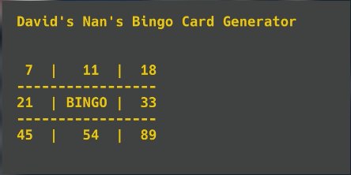

# 👉 Mecca Your Nan Very Happy

Today's challenge is to create a bingo card. Oh yes, because programming's not just for you hip, young cats. 😆

Anyway, your challenge is to enable "gambling for the elderly" (aka Bingo), and you'll achieve it like this:

1. Randomly generate a series of number between 0 and 90.
2. Allocate each number to a place in a 2D list.
3. The numbers should be in numerical order, left to right.
4. Numbers should not be repeated.
5. The center square should not contain a number. It should contain the word 'BINGO!'.
6. When the program is `run`, the bingo card should be displayed on screen.

Example:

 
 💡 Hints 

- Make sure you include 'prettyprinting'.
- Try using a 2D list with each sublist as a row.
- Randomly generate the numbers and append each to a list as you do.
- Use `.sort()` to put the list of numbers in order before adding to the card.

